# [VALORANT TIC TAC TACTICS](https://johnnysontrinh.github.io/valorant-tic-tac-tactics)

Tic Tac Tactics is an interactive web-based game that combines the classic strategy of tic-tac-toe with the dynamic world of Valorant. Players take on the roles of the characters Raze and Cypher, using their unique abilities to conquer the game board.
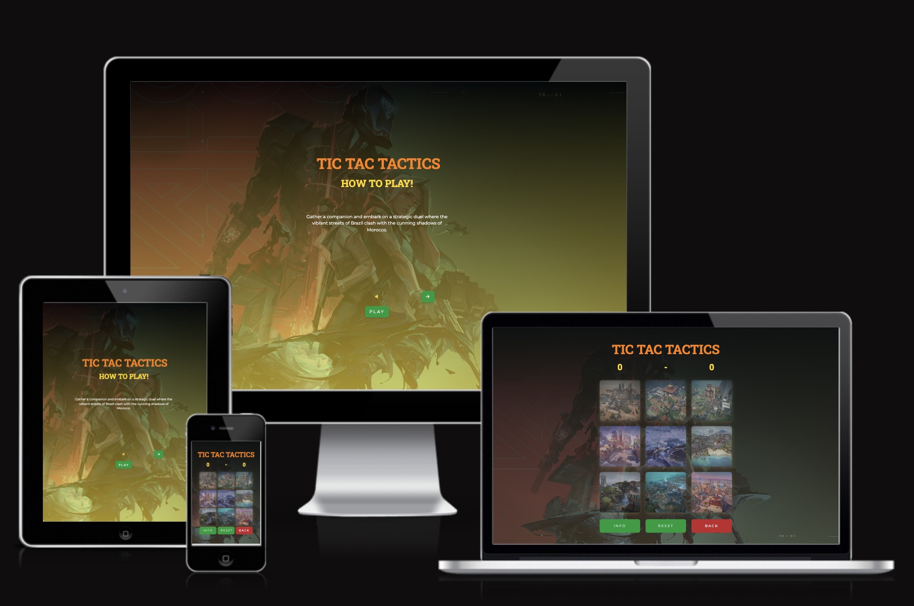

## UX

### Colors Scheme

I used [coolors.co](https://coolors.co/c1272d-ff7f00-ffd700-b8ebd0-009b3a-c9a66b) to generate my colour palette.

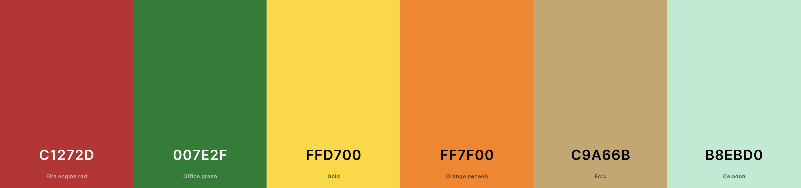

I've used CSS ':root' variables to easily update the global colour scheme by changing only one value instead of everywhere in the CSS file.

```css
/* Root Variables */
:root {
  /* Valorant Theme Colors */
  --clr-primary-1: #c1272d;
  --clr-primary-2: #007e2f;
  --clr-secondary-1: #ffd700;
  --clr-secondary-2: #ff7f00;
  --clr-secondary-3: #c9a66b;
  --clr-secondary-4: #b8ebd0;
  /* Base Colors */
  --clr-black: #000000;
  --clr-white: #ffffff;
  /* Font Family Variables */
  --ff-primary: Roboto Slab, sans-serif;
  --ff-secondary: Montserrat, sans-serif;
  /* Commonly used CSS properties for consistency */
  --transition: all 0.3s linear;
  --spacing: 0.2rem;
  --radius: 0.5rem;
  --light-shadow: 0 5px 15px rgba(201, 166, 107, 0.395);
}
```

### Typography

For Tic Tac Tactics, I've chosen a combination of Roboto Slab and Montserrat fonts to create an engaging and readable user interface. These fonts were selected for their clarity, legibility, and aesthetic appeal, complementing the overall design of the game.

#### Roboto Slab
Roboto Slab is used for headings and areas requiring emphasis. With its semi-rounded details and sturdy serifs, this font adds a touch of elegance and formality, contrasting well with the more straightforward style of Montserrat.

#### Montserrat
Montserrat is the secondary font used throughout the game. Its clean, modern sans-serif design makes it ideal for body text, providing excellent readability and a contemporary look that aligns with the game's visual style.

#### Implementation in CSS
The fonts are included at the beginning of our main CSS file using the `@import` rule from Google Fonts. This method ensures that the fonts are available as soon as the CSS is loaded, maintaining a consistent typographic experience throughout the game.

```css
/* Importing Google Fonts */
@import url("https://fonts.googleapis.com/css2?family=Montserrat&family=Roboto+Slab:wght@700&display=swap");
```

## User Experience

### User Goals

The primary goals for users who visit and play Tic Tac Tactics include:

- Enjoy a fun and engaging game that can be played with friends.
- Experience a familiar game with a unique twist that increases the strategic depth.
- Navigate the site easily with intuitive controls and clear instructions.
- Access the game from various devices with consistent quality and performance.

### Site Owner's Goals

The goals for the site owner are:

- Provide an entertaining and engaging game that encourages repeated play.
- Establish an online presence for users to associate with the [Game or Theme] brand.
- Collect user feedback to continuously improve the gameplay and user experience.
- Monetize the game effectively while maintaining a balance between user satisfaction and revenue generation.

### Requirements

To meet the user and site owner's goals, the following requirements have been identified:

- The game must be fully playable with interactive elements like maps and character abilities.
- A responsive design that adapts to different screen sizes and devices.
- High-quality visuals and sounds that enhance the gameplay experience.
- Clear user instructions and easy navigation throughout the site.


### Expectations

When visiting Tic Tac Tactics, users can expect:

- A visually appealing interface with thematic elements from Valorant.
- Smooth and error-free gameplay with clear outcomes and feedback.
- A secure and reliable website that maintains user privacy and data protection.
- Regular updates and new features to keep the game fresh and exciting.

## Wireframes

For wireframing and viual structuring of my website's layout and design, I chose to utilize [Balsamiq](http://balsamiq.com/wireframes/ "Balsamic"). This tool allowed me to meticulously plan for a user-centric interface, ensuring that the experiance remains consistent and accessible on various devices. My goal throughout the design process was to prioritize ease of use and maintain a cohesive aesthetic from one to the next.

 <details>

 <summary>Desktop Wireframe</summary>

| Page | Screenshots | Notes |
| ---- | ----------- | ----- |
| Index | 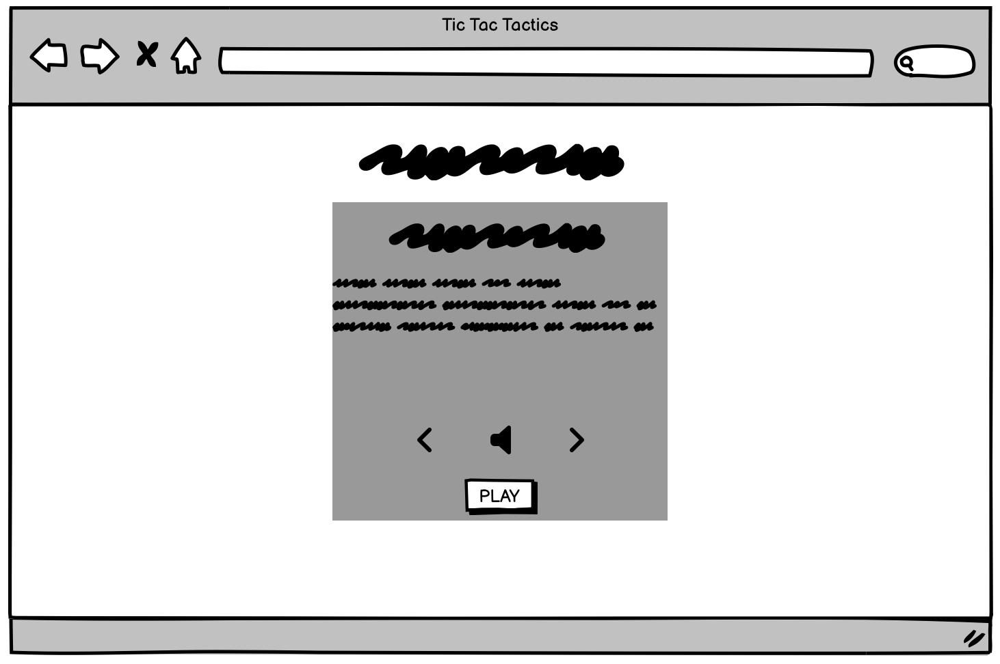 | Home/index page. |
| Play | 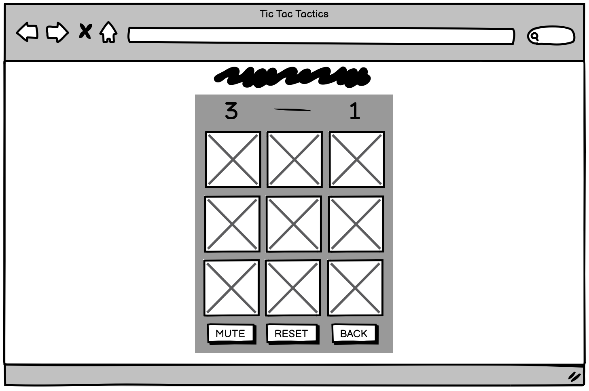 | Game container, what you see after pressing play. |
| Play | 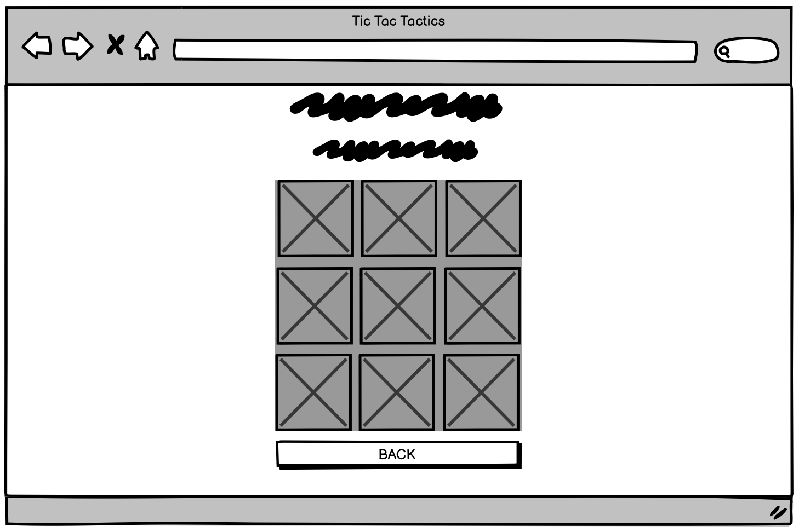 | Miniboard container when you press one map. |
| Thankyou | 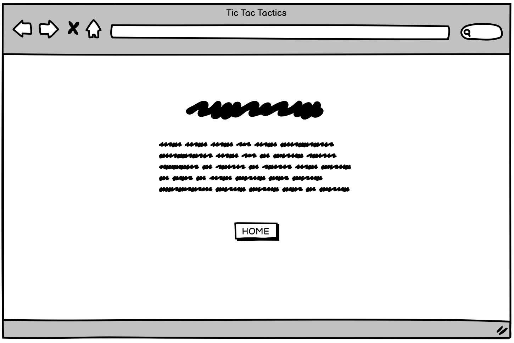 | After getting the ultimate win. |

 </details>
 <details>

<summary>Mobile Wireframe</summary>

| Page | Screenshots | Notes |
| ---- | ----------- | ----- |
| Index | 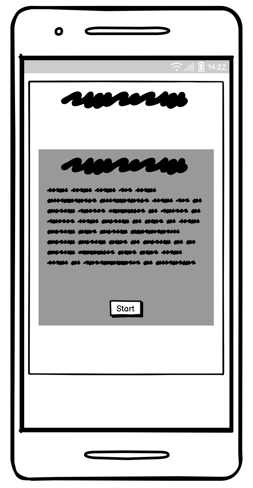 | Home/index page. |
| Play | 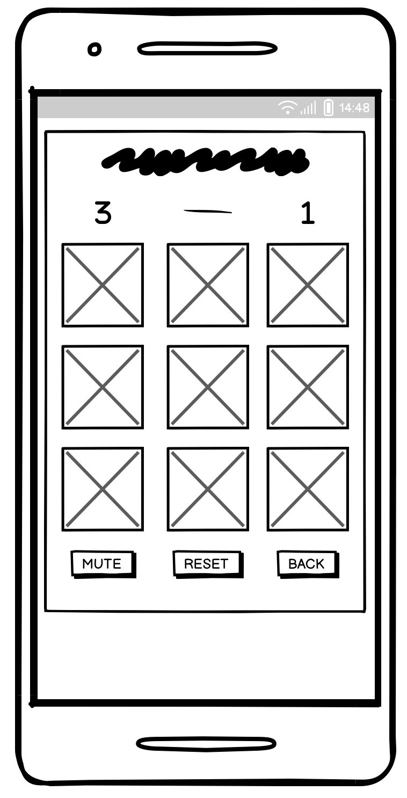 | Game container, what you see after pressing play. |
| Play | 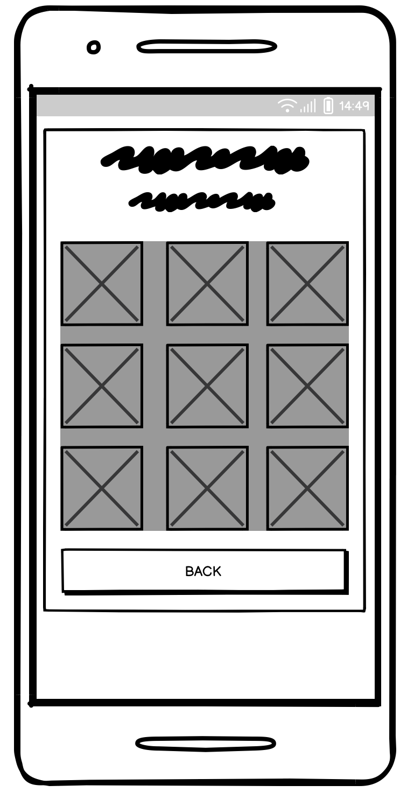 | Miniboard container when you press one map. |
| Thankyou | 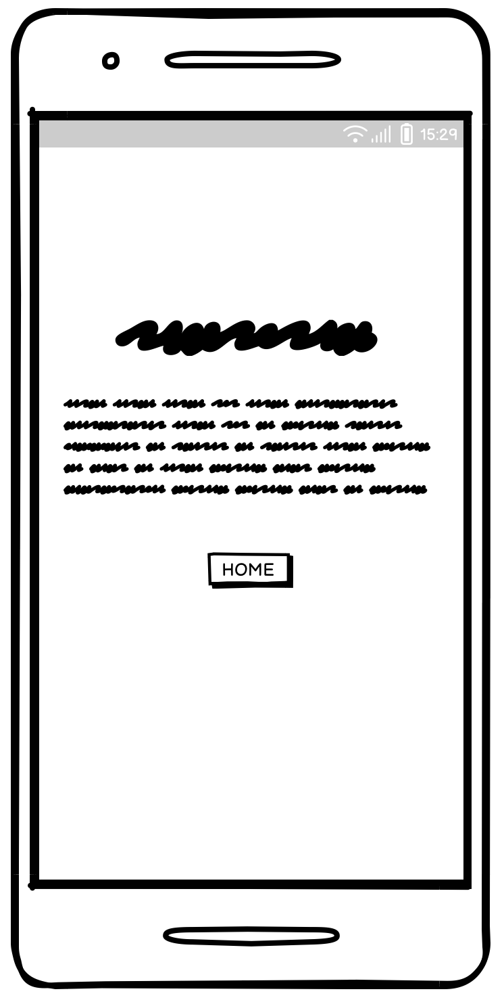 | After getting the ultimate win. |

</details>

## Features

My game features a collection of interactive tic-tac-toe boards inspired by the maps of Valorant, where each board represents a different map in the game universe. Players can easily select a map to play on by simply clicking on it, which brings up a mini tic-tac-toe board for strategic gameplay.

### Starting Screen

  - The gateway to "Tic Tac Tactics" sets the stage for an immersive strategic experience with its vibrant and thematic starting screen. Here's what it offers:


**Engaging Introduction**

  - As soon as players land on the game, they are greeted with a dynamic starting screen that immediately draws them into the world of "Tic Tac Tactics". Featuring artwork that melds the electric ambiance of Brazil with the mysterious allure of Morocco, it promises an exciting clash of cultures and strategies.

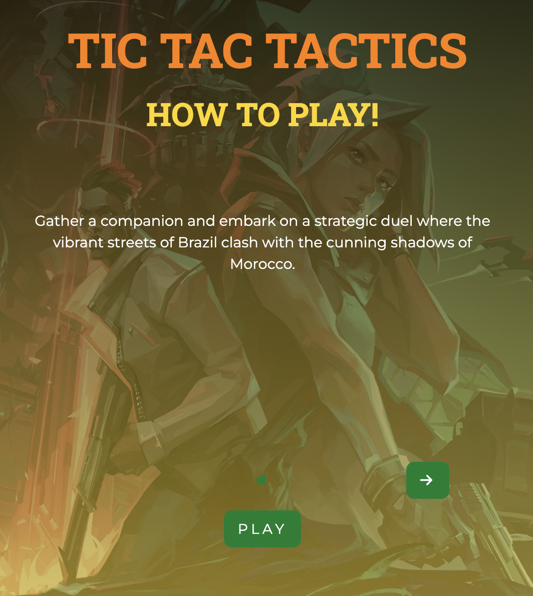

**Simple Navigation**

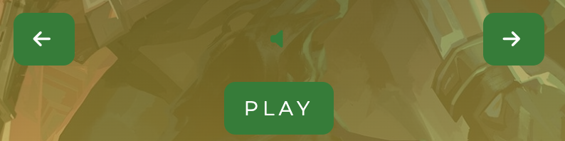

  - The music button on the starting screen allows players to tailor the auditory experience to their preference. This button toggles the game's music, offering an immersive audio backdrop for those who desire it, or silence for those who prefer to strategize in quiet. Its design is consistent with the game's overall theme, ensuring a seamless integration into the user interface.

  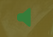

  - Focus of the starting screen is the "Play" button, encapsulated in a sleek and modern design that's hard to miss. This intuitive interface ensures players know exactly how to begin their adventure with just one click.

  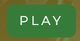

  - Flanking the "Music" button are arrow buttons, integral for players to navigate through the game's tutorial text. These arrows, clearly distinguishable and responsive, allow players to scroll through the introductory text at their own pace. The left arrow takes the player to the previous piece of information, while the right arrow progresses to the next, ensuring that each player is well-informed and prepared before they hit "Play".

  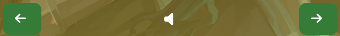

### Map Selection

- The map selection screen is a gateway to the strategic core  of Tic Tac Tactics. Here, players are greeted with a visual feast of maps, each representing a distinct arena from the game's universe. The scoreboard, prominently displayed at the top, keeps track of the ongoing duel's score, fueling the competitive spirit.

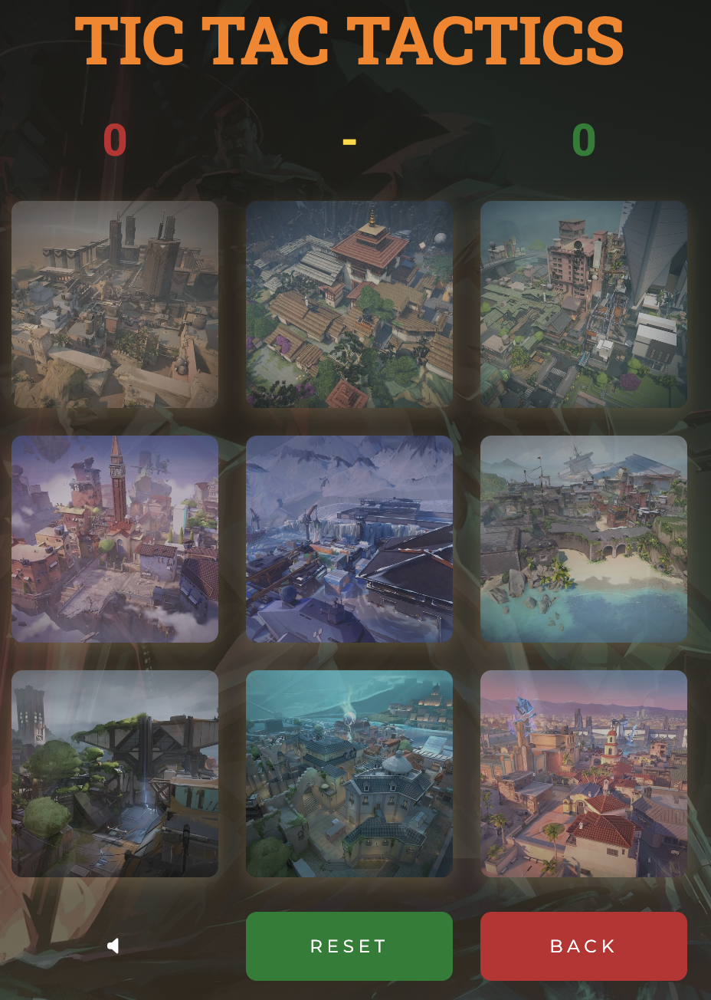

- Below the scoreboard, the maps are laid out in a 3x3 grid, mirroring the tic-tac-toe structure and allowing players to choose their battleground with a simple click. This familiar layout ensures an intuitive selection process, drawing players into the gameplay without any confusion.

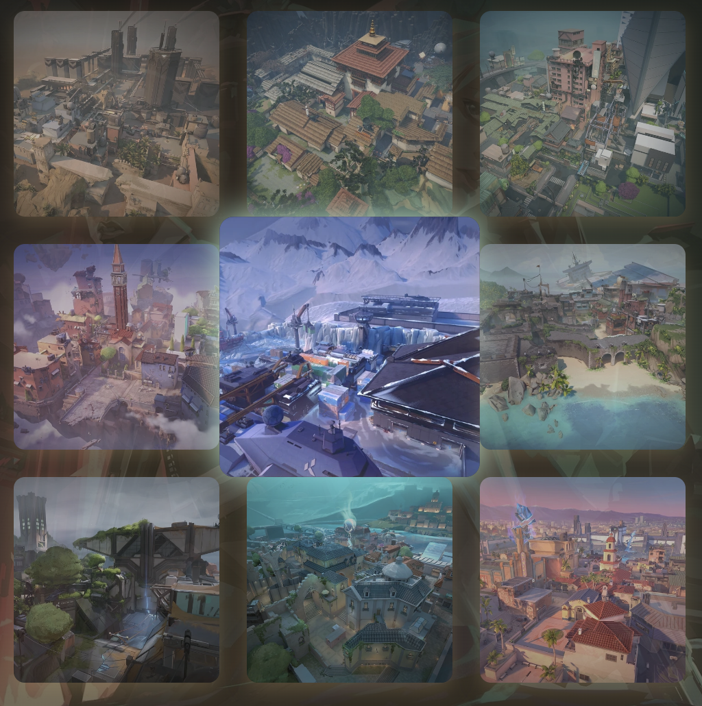

- At the bottom of the screen, 3 buttons, "Music" "Reset" and "Back" offer clear options for starting afresh or revisiting previous screens. The "Reset" button, highlighted in a calming green, suggests a new beginning, while the "Back" button in red signals a cautious step back to reconsider if you want to go to start screen.

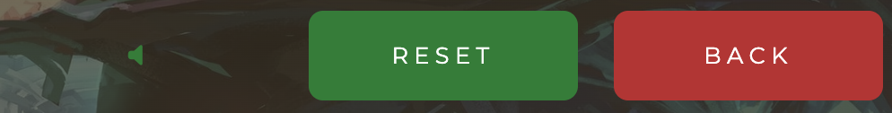

- Each map is a clickable portal to a mini-game, where players will engage in the classic game of tic-tac-toe with a Valorant-inspired twist. The design's simplicity, paired with the vivid imagery of the maps, provides an engaging user interface that is both functional and aesthetically pleasing, ensuring players are fully immersed from the outset.


### Future Features

**Multiplayer Mode**
- Introduce a real-time multiplayer mode where players can challenge friends or other online players. This feature aims to foster a competitive and social environment within the game.

**Customizable Avatars**
- Allow players to create and customize their own avatars, adding a personal touch to the gaming experience.

**New Maps and Characters**
- Regularly introduce new maps and characters from the Valorant universe to keep the game fresh and engaging.

**Sound** 
- Design a distinct sound that captures the theme of each map and ulitmate Victory adding an auditory layer to the visual experience.

**Playing vs Computer**
- Implement subtle sound cues for computer moves, providing audio feedback that helps players understand the game's flow when playing against AI.
## Tools & Technologies Used


- [HTML](https://en.wikipedia.org/wiki/HTML) used for the main site content.
- [CSS](https://en.wikipedia.org/wiki/CSS) used for the main site design and layout.
- [CSS :root variables](https://www.w3schools.com/css/css3_variables.asp) used for reusable styles throughout the site.
- [CSS Flexbox](https://www.w3schools.com/css/css3_flexbox.asp) used for an enhanced responsive layout.
- [CSS Grid](https://www.w3schools.com/css/css_grid.asp) used for an enhanced responsive layout.
- [JavaScript](https://www.javascript.com) used for user interaction on the site.
- [Git](https://git-scm.com) used for version control. (`git add`, `git commit`, `git push`)
- [GitHub](https://github.com) used for secure online code storage.
- [GitHub Pages](https://pages.github.com) used for hosting the deployed front-end site.
- [Visual Studio Code](https://code.visualstudio.com/) used as a cloud-based IDE for development.
- [Bootstrap](https://getbootstrap.com) used as the front-end CSS framework for responsive design.
- [Am I Responsive](http://ami.responsivedesign.is/) - used to verify responsiveness of website on different devices.
-  [FL Studio](https://www.image-line.com/) used to create music.

## Testing

For all testing, please refer to the [TESTING.md](TESTING.md) file.

## Deployment

The site was deployed to GitHub Pages. The steps to deploy are as follows:

- In the [GitHub repository](https://github.com/JohnnySonTrinh/a-gamers-portfolio-site), navigate to the Settings tab
- From the source section drop-down menu, select the **Main** Branch, then click "Save".
- The page will be automatically refreshed with a detailed ribbon display to indicate the successful deployment.

The live link can be found [here](https://johnnysontrinh.github.io/a-gamers-portfolio-site)

### Local Deployment

This project can be cloned or forked in order to make a local copy on your own system.

### Cloning

You can clone the repository by following these steps:

1. Go to the [GitHub repository](https://github.com/JohnnySonTrinh/a-gamers-portfolio-site)
2. Locate the Code button above the list of files and click it
3. Select if you prefer to clone using HTTPS, SSH, or GitHub CLI and click the copy button to copy the URL to your clipboard
4. Open Git Bash or Terminal
5. Change the current working directory to the one where you want the cloned directory
6. In your IDE Terminal, type the following command to clone my repository:
   - `git clone https://github.com/JohnnySonTrinh/a-gamers-portfolio-site.git`
7. Press Enter to create your local clone.

Alternatively, if using Gitpod, you can click below to create your own workspace using this repository.

[](https://gitpod.io/#https://github.com/JohnnySonTrinh/a-gamers-portfolio-site)

Please note that in order to directly open the project in Gitpod, you need to have the browser extension installed.
A tutorial on how to do that can be found [here](https://www.gitpod.io/docs/configure/user-settings/browser-extension).

#### Forking

By forking the GitHub Repository, we make a copy of the original repository on our GitHub account to view and/or make changes without affecting the original owner's repository.
You can fork this repository by using the following steps:

1. Log in to GitHub and locate the [GitHub Repository](https://github.com/JohnnySonTrinh/valorant-tic-tac-tactics)
2. At the top of the Repository (not top of page) just above the "Settings" Button on the menu, locate the "Fork" Button.
3. Once clicked, you should now have a copy of the original repository in your own GitHub account!

### Local VS Deployment

During the development of "VALORANT TIC TAC TACTICS," I maintained a consistent environment between local development and live deployment. This approach ensured a smooth and issue-free transition when deploying the game.

## Credits

I am grateful for the various resources and individuals who contributed to the successful completion of this project:

### Content

| Source                                                                      | Location           | Notes                                            |
| --------------------------------------------------------------------------- | ------------------ | ------------------------------------------------ |
| [Markdown Builder](https://tim.2bn.dev/markdown-builder)                    | README and TESTING | tool to help generate the Markdown files         |
| [Chris Beams](https://chris.beams.io/posts/git-commit)                      | version control    | "How to Write a Git Commit Message"              |
| [W3Schools](https://www.w3schools.com/howto/howto_js_topnav_responsive.asp) | entire site        | responsive HTML/CSS/JS navbar                    |
| [Youtube](https://youtu.be/onSGAEanl_Y?si=PZHb_kh37PWSXMrH)           | Player turn/grid      | Grid layouts aswell indicatior for players turn                       |
| [W3Schools](https://www.w3schools.com/css/css3_variables.asp)               | entire site        | how to use CSS :root variables                   |
| [Flexbox Froggy](https://flexboxfroggy.com/)                                | entire site        | modern responsive layouts                        |
| [Grid Garden](https://cssgridgarden.com)                                    | entire site        | modern responsive layouts                        |

### Media

The visual elements play a crucial role in creating an immersive and engaging experience on the game. Here's a breakdown of the various media sources:

- **Valorant Images**: The striking image of Agent [Raze](https://valorant.fandom.com/wiki/Raze) and [Cypher](https://valorant.fandom.com/wiki/Cypher), featured mini-boards, was sourced from [Valorant Wiki](https://valorant.fandom.com/). The maps [Ascent](https://valorant.fandom.com/wiki/Ascent), [Bind](https://valorant.fandom.com/wiki/Bind), [Breeze](https://valorant.fandom.com/wiki/Breeze), [Fracture](https://valorant.fandom.com/wiki/Fracture), [Haven](https://valorant.fandom.com/wiki/Haven), [Icebox](https://valorant.fandom.com/wiki/Icebox), [Pearl](https://valorant.fandom.com/wiki/Pearl), [Split](https://valorant.fandom.com/wiki/Split), [Sunset](https://valorant.fandom.com/wiki/Sunset) for Map selection board.

- **Music** Made with a friend inspiration [Blind Pick](https://www.youtube.com/watch?v=Q4UwsxvVnmI) by riot games.

- **Icons**: Various icons from [Font Awesome](https://fontawesome.com) are utilized throughout the site to enhance its aesthetic appeal and user navigation. Specific icons include:
- [Arrow-left](https://fontawesome.com/icons/arrow-left?f=classic&s=regular)
- [Arrow-right](https://fontawesome.com/icons/arrow-right?f=classic&s=regular)
- [Volume-off](https://fontawesome.com/icons/volume-off?f=classic&s=solid)
- [Volume-high](https://fontawesome.com/icons/volume-high?f=classic&s=solid)
- Social media icons like [GitHub](https://fontawesome.com/icons/github?f=brands&s=solid), [Instagram](https://fontawesome.com/icons/instagram?f=brands&s=solid), and [LinkedIn](https://fontawesome.com/icons/linkedin?f=brands&s=solid) to facilitate easy connectivity with users on various platforms.

## Acknowledgements

- A special thanks to my mentor, [Tim Nelson](https://github.com/TravelTimN), for their invaluable guidance, support, and insights throughout the development process.
- I would like to thank the [Code Institute Slack community](https://code-institute-room.slack.com) for testing my game and finding bugs.
- A special mention to my dog, Loke, who has been an unexpected companion in this coding adventure. His presence and, in his own way, helping me 'debug' my code during those long nights has been a source of comfort and motivation.
