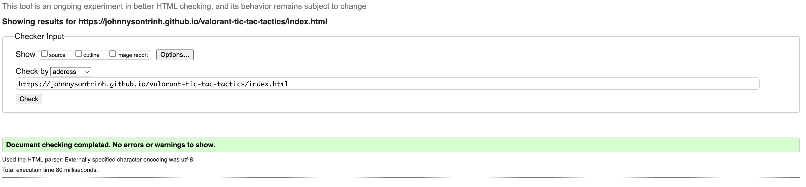
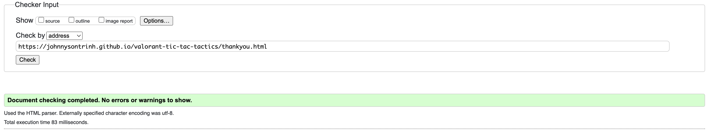
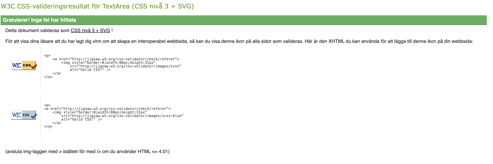
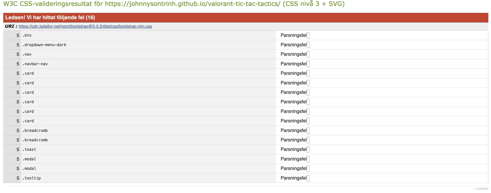
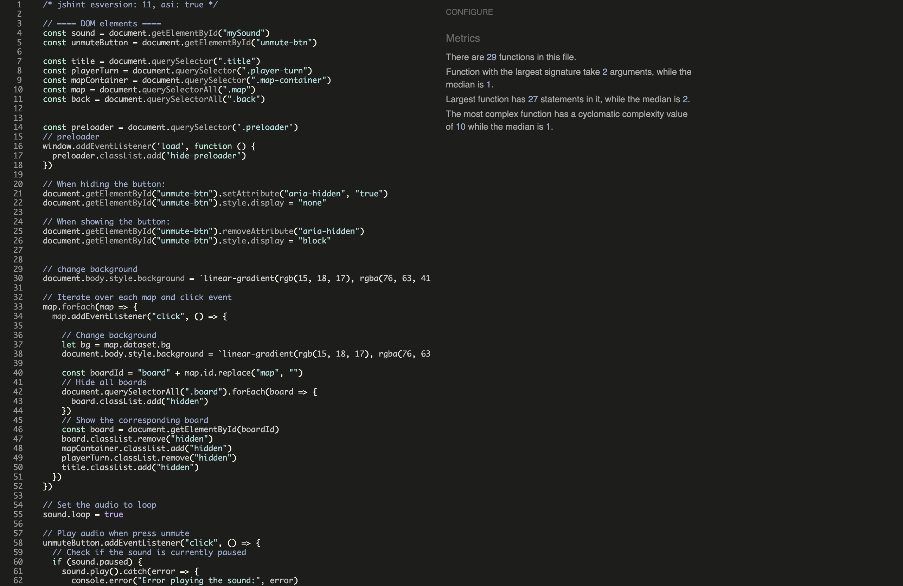
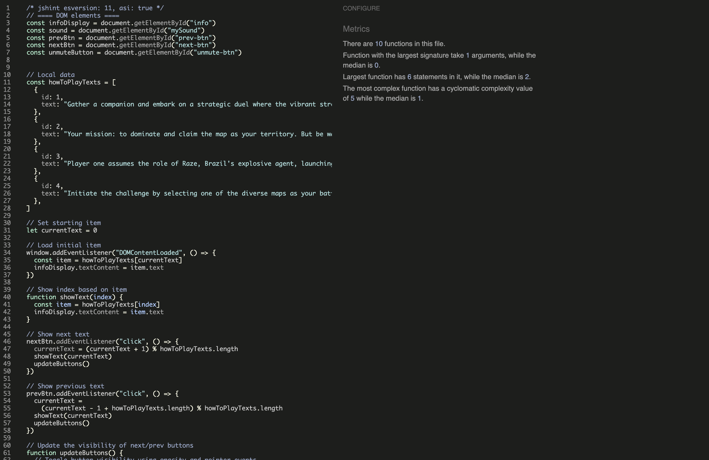
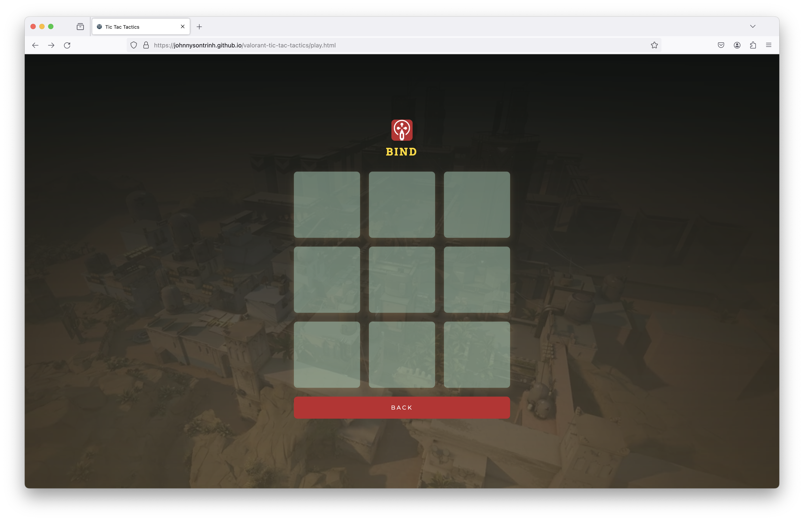

# Testing

Return back to the [README.md](README.md) file.

Welcome to the Tic Tac Tactics Site testing results, in this file you will see how each and every element tested to ensure each element worked as intended.

## Code Validation

### HTML

I have used the recommended [HTML W3C Validator](https://validator.w3.org) to validate all of my HTML files.

| Page | W3C                                                                                                                         | Screenshot | Notes |
| ---- | --------------------------------------------------------------------------------------------------------------------------- | ---------- | ----- |
| Home | [W3C Home](https://validator.w3.org/nu/?doc=https%3A%2F%2Fjohnnysontrinh.github.io%2Fvalorant-tic-tac-tactics%2Findex.html) | | Pass: No Errors |
| Play | [W3C Play](https://validator.w3.org/nu/?doc=https%3A%2F%2Fjohnnysontrinh.github.io%2Fvalorant-tic-tac-tactics%2Fplay.html) |  | Pass: No Errors |
| Thank you | [W3C Thank you](https://validator.w3.org/nu/?doc=https%3A%2F%2Fjohnnysontrinh.github.io%2Fvalorant-tic-tac-tactics%2Fthankyou.html) |  | Pass: No Erros |

### CSS

I have used the recommended [CSS Jigsaw Validator](https://jigsaw.w3.org/css-validator) to validate all of my CSS files.

| Page | Jigsaw URL | Screenshot | Notes |
| ---- | ---------- | ---------- | ----- |
| Style | None |  | Pass: No Errors |
| Page | [Jigsaw W3C](https://jigsaw.w3.org/css-validator/validator?uri=https%3A%2F%2Fjohnnysontrinh.github.io%2Fvalorant-tic-tac-tactics%2F&profile=css3svg&usermedium=all&warning=1&vextwarning=&lang=en) |  | Fail: parse error (Bootstrap) |

### JavaScript

I have used the recommended [JShint Validator](https://jshint.com) to validate all of my JS files.

| File | Screenshot | Notes |
| ---- | ---------- | ----- |
| App |  | Pass: No Errors |
| Script |  | Pass: No Erros

## Browser Compatibility

I've tested my deployed project on multiple browsers to check for compatibility issues.

| Browser | Home | Map board | Mini baords | Thank you | Notes |
| ----- | ----- | ----- | ----- | ----- | ----- |
| Chrome |  |   |   |   | Works as expected |
| Firefox |  |   |   |   | Works as expected |
| Safari |  |   |   |   | Works as expected |
| Opera GX |  |   |   |   | Works as expected |

