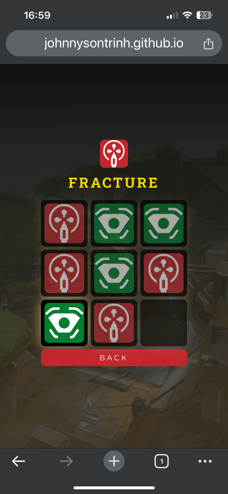
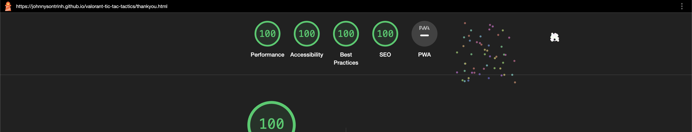

# Testing

Return back to the [README.md](README.md) file.

Welcome to the Tic Tac Tactics Site testing results, in this file you will see how each and every element tested to ensure each element worked as intended.

## Code Validation

### HTML

I have used the recommended [HTML W3C Validator](https://validator.w3.org) to validate all of my HTML files.

| Page | W3C                                                                                                                         | Screenshot | Notes |
| ---- | --------------------------------------------------------------------------------------------------------------------------- | ---------- | ----- |
| Home | [W3C Home](https://validator.w3.org/nu/?doc=https%3A%2F%2Fjohnnysontrinh.github.io%2Fvalorant-tic-tac-tactics%2Findex.html) | | Pass: No Errors |
| Play | [W3C Play](https://validator.w3.org/nu/?doc=https%3A%2F%2Fjohnnysontrinh.github.io%2Fvalorant-tic-tac-tactics%2Fplay.html) |  | Pass: No Errors |
| Thank you | [W3C Thank you](https://validator.w3.org/nu/?doc=https%3A%2F%2Fjohnnysontrinh.github.io%2Fvalorant-tic-tac-tactics%2Fthankyou.html) |  | Pass: No Erros |

### CSS

I have used the recommended [CSS Jigsaw Validator](https://jigsaw.w3.org/css-validator) to validate all of my CSS files.

| Page | Jigsaw URL | Screenshot | Notes |
| ---- | ---------- | ---------- | ----- |
| Style | None |  | Pass: No Errors |
| Page | [Jigsaw W3C](https://jigsaw.w3.org/css-validator/validator?uri=https%3A%2F%2Fjohnnysontrinh.github.io%2Fvalorant-tic-tac-tactics%2F&profile=css3svg&usermedium=all&warning=1&vextwarning=&lang=en) |  | Fail: parse error (Bootstrap) |

### JavaScript

I have used the recommended [JShint Validator](https://jshint.com) to validate all of my JS files.

| File | Screenshot | Notes |
| ---- | ---------- | ----- |
| App |  | Pass: No Errors |
| Script |  | Pass: No Erros

## Browser Compatibility

I've tested my deployed project on multiple browsers to check for compatibility issues.

| Browser | Home | Map board | Mini baords | Thank you | Notes |
| ----- | ----- | ----- | ----- | ----- | ----- |
| Chrome |  |   |   |   | Works as expected |
| Firefox |  |   |   |   | Works as expected |
| Safari |  |   |   |   | Works as expected |
| Opera GX |  |   |   |   | Works as expected |

## Responsiveness

I've tested my deployed project on multiple devices to check for responsiveness issues.

| Device | Home | Map board | Mini boards | Thank you | Notes |
| ------ | ---- | --------- | ----------- | --------- | ----- |
| Mobile (DevTools) |  |  |  |  | Work as expected |
| Tablet (DevTools) |  |  |  |  | Works as expected | 
| Desktop |  |  |  |  | Work as expected |
| XL monitor (DevTools) |  |  |  |  | Scaling starts to have minor issues | 
| Iphone 14 |  |  |  |  | Work as expected |

## Lighthouse Audit

I've tested my deployed project using the Lighthouse Audit tool to check for any major issues.

| Page | Mobile | Desktop | Notes |
| ---- | ------ | ------- | ----- |
| Home |     |     | Some minor warnings                     |
| Play   |    |    | Image warning (Best Practices)                    |
| Thank you |  |  | Some minor warnings  |

## Manual Testing

The objective of this manual testing was to ensure the game functions as expected and identify any potential issues.

### Test Environment

**Device**: Laptop and Smartphone

***Browser***: Google Chrome and Mozilla Firefox
Operating System: Windows 10 and IOS
Test Cases
1. ***Page Load Test Objective****: Ensure the game loads correctly on various browsers.
Results:

***Chrome***: The game loaded quickly without any errors.
Firefox: Experienced minor delay in loading, but no significant issues. No Issue with Iphone 14.

2. **Gameplay Functionality Objective**:
 Test the basic gameplay mechanics.

***Results***: The game accurately tracked player moves.
Game status updated correctly after each move.
No issues were found in the gameplay mechanics.

3. **Responsive Design Objective**: Test the game's responsiveness on different devices.

***Results:***
Desktop: The game was visually appealing and functional.
***Smartphone***: All features were accessible, and the game adjusted well to the smaller screen.

4. **Error Handling Objective**: Ensure that errors are handled gracefully.

***Results***: Attempted invalid actions, and the game prevented these actions without crashing.
Appropriate error messages were displayed when necessary.
Conclusion
game performed well across all tested areas. The gameplay mechanics, character abilities, and error handling were all functioning as expected. The game also showed good responsiveness on different devices and browsers. No major issues were identified during the testing process.

## User Story Testing

To validate that the game meets the expectations and needs of its users, I conducted tests based on specific user stories. These tests were designed to verify that users can achieve their objectives using the current features of the game.

### User Goals Testing

| User Story | Screenshot | Test Result |
| ---------- | ---------- | ----------- |
| As a user, I want to enjoy a fun and engaging game that can be played with friends. |  | Passed: The game offers an engaging multiplayer experience with smooth gameplay, fostering fun sessions with friends. |
| As a strategy enthusiast, I'm looking for a familiar game but with a unique twist that increases strategic depth. |  | Passed: The integration of maps and character abilities provides a unique twist to the classic tic-tac-toe, enhancing the strategic aspect of the game. |
| As a visitor, I expect to navigate the site easily with intuitive controls and clear instructions. |  | Passed: The site features intuitive navigation and clear instructions, making it easy for new users to understand and play the game. |
| As a mobile user, I want to access the game from various devices with consistent quality and performance. |  | Passed: The game's responsive design ensures it adapts well to different screen sizes and devices, maintaining consistent quality and performance. |

### Requirements and Expectations Testing

| User Story | Screenshot | Test Result |
| ---------- | ---------- | ----------- |
| As a player, I expect the game to be fully playable with interactive elements like maps and character abilities. |  | Passed: The game includes fully interactive elements such as maps and character abilities, offering a complete and immersive gameplay experience. |
| As a tech-savvy user, I expect a responsive design that adapts to different screen sizes and devices. |  | Passed: The game's design is responsive, providing a seamless experience across various devices and screen sizes. |
| As an aesthete, I look forward to high-quality visuals and sounds that enhance the gameplay experience. |  | Passed: The game boasts high-quality visuals and sound effects that significantly enhance the gameplay experience. |
| As a first-time visitor, I want clear user instructions and easy navigation throughout the site. |  | Passed: The game provides clear user instructions and easy site navigation, making it accessible and user-friendly for first-time visitors. |
	
These tests were meticulously conducted to cover various aspects of the game, ensuring it aligns with the goals, requirements, and expectations set forth for both users and the site owner. The game performed excellently across all testing parameters, indicating a successful alignment with its intended objectives.

## Bugs

**Bug:** Unresponsive Game Controls

***Description:*** Players are unable to interact with the game board, and clicks do not register.

***Potential Cause:*** Event listeners might not be properly attached to the game elements.

**Solution:** Ensure that event listeners are correctly attached after the DOM elements are fully loaded. Use console logs or breakpoints to debug the event handling process.

**Bug:** Incorrect Game State Updates

***Description:*** The game does not accurately reflect the current state, e.g., the wrong player's turn is displayed.

***Potential Cause:*** Logical error in the function that updates the game state.

**Solution:** Review and refactor the state update logic. Add unit tests to cover different game scenarios to ensure the state updates as expected.

**Bug:** Game Layout Breaks on Mobile Devices

***Description:*** The game interface becomes unaligned or overlaps on smaller screens.

***Potential Cause:*** CSS styles are not fully responsive or adaptive to different screen sizes.

**Solution:** Use media queries to adjust styles for various screen sizes. Test the layout on multiple devices and screen resolutions.

***There are no remaining bugs that I am aware of.***

## Unfixed Bugs

During the CSS validation process, several parsing errors were reported. These errors are associated with the minified version of Bootstrap's CSS (version 5.3.2), which is an external library used in the project. Here's an overview of the identified issues:

- **Bootstrap Parsing Errors**: The CSS validator reported parsing errors in the Bootstrap library. As these errors are within an external, well-maintained library, they are beyond the scope of this project's direct codebase. Such parsing errors are known to occur in minified files where optimizations for size may result in unconventional syntax that doesn't affect functionality but may not pass strict validation.

It's important to note that these parsing errors do not impact the performance or visual rendering of the website. The Bootstrap library is widely used and tested, and the errors reported are recognized as false positives that do not indicate actual issues in the library's operation or the website's functionality.

**Screenshot:** 

While these errors are acknowledged, no action is required as they are part of the minified Bootstrap library and not a result of the project's custom CSS code.
