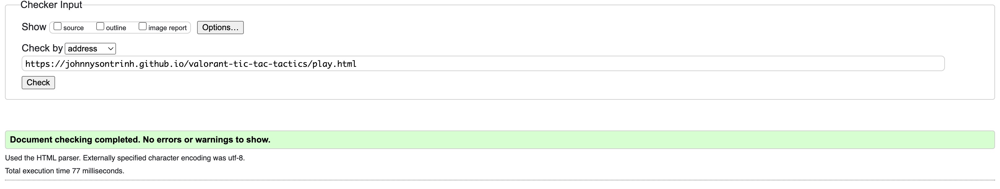

# Testing

Return back to the [README.md](README.md) file.

Welcome to the Tic Tac Tactics Site testing results, in this file you will see how each and every element tested to ensure each element worked as intended.

## Code Validation

### HTML

I have used the recommended [HTML W3C Validator](https://validator.w3.org) to validate all of my HTML files.

| Page | W3C                                                                                                                         | Screenshot | Notes |
| ---- | --------------------------------------------------------------------------------------------------------------------------- | ---------- | ----- |
| Home | [W3C Home](https://validator.w3.org/nu/?doc=https%3A%2F%2Fjohnnysontrinh.github.io%2Fvalorant-tic-tac-tactics%2Findex.html) | | Pass: No Errors |
| Play | [W3C Play](https://validator.w3.org/nu/?doc=https%3A%2F%2Fjohnnysontrinh.github.io%2Fvalorant-tic-tac-tactics%2Fplay.html) |  | Pass: No Errors |
| Thank you | [W3C Thank you](https://validator.w3.org/nu/?doc=https%3A%2F%2Fjohnnysontrinh.github.io%2Fvalorant-tic-tac-tactics%2Fthankyou.html) |  | Pass: No Erros |

### Issue:

The "Previous" and "Next" navigation buttons were moving to the center when one of them was hidden, causing an inconsistent user interface experience.

### Impact:

This issue caused confusion for users as the expected navigation layout changed between steps, affecting the overall usability of the application.

### Steps to Reproduce:

1. Load the "How to Play" section of the game.
2. Navigate to the first page of instructions where the "Previous" button should not be visible.
3. Observe the position of the "Next" button shifting to the center.

### Resolution:

Implemented a CSS solution using `opacity` and `pointer-events` to hide the buttons instead of `display: none`. This approach ensures the buttons retain their space in the layout even when they are not visible, maintaining the expected layout.

### Status:

